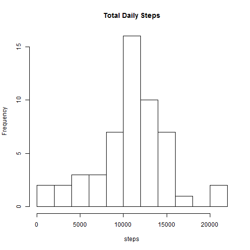
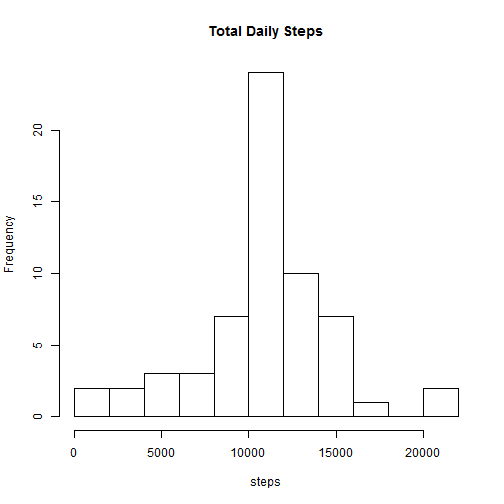

# Reproducible Research: Peer Assessment 1  

***This assignment makes use of data from a personal activity monitoring device. This device collects data at 5 minute intervals throughout the day. The data consists of two months of data from an anonymous individual collected during the months of October and November, 2012, and includes the number of steps taken in 5 minute intervals each day.*** 

Data is made available through Johns Hopkins' [Reproducible Research](https://www.coursera.org/course/repdata) course via Coursera and can be downloaded [here](http://d396qusza40orc.cloudfront.net/repdata%2Fdata%2Factivity.zip).

Date accessed: 2014-08-15

## Load data

Download, unzip and read in .csv data and take a look at its structure.


```r
temp <- tempfile() # create temp file to hold zip folder
download.file("http://d396qusza40orc.cloudfront.net/repdata%2Fdata%2Factivity.zip", temp)
activity <-read.csv(unz(temp, "activity.csv")) # unzip and read in .csv file into R object 'activity'
unlink(temp) # drop temp file
str(activity)
```

```
## 'data.frame':	17568 obs. of  3 variables:
##  $ steps   : int  NA NA NA NA NA NA NA NA NA NA ...
##  $ date    : Factor w/ 61 levels "2012-10-01","2012-10-02",..: 1 1 1 1 1 1 1 1 1 1 ...
##  $ interval: int  0 5 10 15 20 25 30 35 40 45 ...
```

## Histogram, mean and median of total daily steps

The following histogram shows the frequency distribution of the *total* steps taken per day. The total daily steps, i.e., the sums of the steps observed for each of the 288 intervals per day, are first computed using the aggregate() function giving us a data frame with 1 row per day.


```r
data1 <- aggregate(steps ~ date, activity, sum) # total steps per day
str(data1)
```

```
## 'data.frame':	53 obs. of  2 variables:
##  $ date : Factor w/ 61 levels "2012-10-01","2012-10-02",..: 2 3 4 5 6 7 9 10 11 12 ...
##  $ steps: int  126 11352 12116 13294 15420 11015 12811 9900 10304 17382 ...
```

Let's take a quick look at the structure of the variable 'steps,' which is now in fact *total daily* steps, that we will use to construct the histogram.


```r
str(data1$steps)
```

```
##  int [1:53] 126 11352 12116 13294 15420 11015 12811 9900 10304 17382 ...
```

We can see that there are now 53 observations (instead of 61) suggesting that there are 8 days for which there are no observations for the variable 'steps.'  
To confirm this we can count the number of dates that have a frequency of 0 in the new data frame by using the table() function.


```r
tbl <- table(data1$date)
length(which(tbl == 0))
```

```
## [1] 8
```

Finally, let's construct the histogram.


```r
hist(data1$steps, 10, main = "Total Daily Steps", xlab = "steps")
```

 

We can see a fairly normal distribution with an ever slight left skew.  
Now let's calculate the mean and median for total daily steps from the aggregated data.


```r
mean(data1$steps)
```

```
## [1] 10766
```

```r
median(data1$steps)
```

```
## [1] 10765
```

The mean total daily steps is 10766 and the median is 10765, confirming a slight left skew in the distribution.

## Average daily activity pattern 

This plot shows the average number of daily steps by 5 minute intervals. The interval means are found by again using the aggregate() function giving us a compact data frame, this time with 1 row per interval. It appears that on average the individual woke shortly after 5:00 am, was most active at around 8:30 am and was least active after 7:00 pm.


```r
data2 <- aggregate(steps ~ interval, activity, mean) # mean steps per invterval
str(data2)
```

```
## 'data.frame':	288 obs. of  2 variables:
##  $ interval: int  0 5 10 15 20 25 30 35 40 45 ...
##  $ steps   : num  1.717 0.3396 0.1321 0.1509 0.0755 ...
```

```r
plot(data2, type = "l")
```

 

Find the interval (i.e., time) with highest average of number of steps.


```r
data2[which.max(data2$steps),] # returns the interval with max value of mean steps per interval
```

```
##     interval steps
## 104      835 206.2
```

Interval 835 has the highest average number of steps with 206 meaning that when broken down into 5 minute intervals, on average, the individual took the most steps between 8:35 and 8:40 am each day.

## Impute missing values

Find the number of rows with missing values (NAs).


```r
sum(is.na(activity)) # total rows with NAs in original data set
```

```
## [1] 2304
```

Let's see how they are distributed.


```r
colSums(is.na(activity))
```

```
##    steps     date interval 
##     2304        0        0
```

There are a total of 2304 rows with missing values with all of them occurring in the 'steps' column. This makes sense considering that we already know that there are 8 days without any observations for the variable 'steps': 2304/ 288 = ` 8 days. This information also shows us that for the rest of the 53 days there are no NAs. i.e., all the NAs are accounted for by the 8 days.  

The mean of the intervals, data2[ ,2], generated in the last section, will be used to impute NAs. To do this, first an index vector x is created for the rows that contain NAs for the variable 'steps' in the original data set 'activity.' A copy of the original data set is then made and the NAs are filled in with the interval means. The final argument can be read as *replace all instances of NAs in column 1 of data3 with the values in column 2 of data2.*


```r
x <- which(is.na(activity)) # create index of rows that contain NAs
data3 <- activity # generate duplicate of activity data
data3[x,1] <- data2[,2] # replace NAs with mean steps by interval
```

\******Note that this method only works because of the structure of the data. The vectors data2[ ,2] and data3[x,1] are ordered exactly the same by interval, from 0 to 2355, with data3[x,1] being exactly 8 times the length of data2[ ,2], therefore, the interval means are repeated 8 times for each of the 8 days with missing values. If the NAs were randomly distributed, another method would have to be used******

Let's check our work.


```r
sum(is.na(data3)) # total rows with NAs in new data set with imputed values
```

```
## [1] 0
```

To be sure, let's see if the values were filled properly for the first day with all NAs. First we will use the frequency table of dates we created earlier to find the dates that had all NAs.


```r
which(tbl == 0) # finds which dates have a frequency of 0 in aggregated data1
```

```
## 2012-10-01 2012-10-08 2012-11-01 2012-11-04 2012-11-09 2012-11-10 
##          1          8         32         35         40         41 
## 2012-11-14 2012-11-30 
##         45         61
```

```r
table(data3[which(data3[,2] == "2012-10-01"),1] == data2[,2]) # checks for matching values
```

```
## 
## TRUE 
##  288
```

This tells us that all the values for 'steps' in data3 for October 1st 2012 match their respective interval means. Mission accomplished.

## Histogram, mean and median of total daily steps with imputed values

Now we will create a histogram of the total daily steps using our new data with the imputed NAs, as well as find the mean and median for total daily steps.


```r
data4 <- aggregate(steps ~ date, data3, sum) # gives total steps by day with imputed NAs
hist(data4$steps, 10, main = "Total Daily Steps", xlab = "steps")
```

 

```r
mean(data4$steps)
```

```
## [1] 10766
```

```r
median(data4$steps)
```

```
## [1] 10766
```

We can see that although the mean and median are now the same, the imputed values do not have much of an impact on the two estimates. 

## Activity patterns: weekdays and weekends

To look at any differences in activity patterns between weekdays and weekends we will first create a factor variable with levels 'weekday' and 'weekend' using the data with the imputed values.


```r
data3$day <- weekdays(as.Date(data3$date)) # use data with imputed NAs; create day variable
data3$daytype <- as.factor(data3$day == "Saturday" | data3$day == "Sunday") # create factor variable
levels(data3$daytype) <- c("weekday", "weekend") # assign levels to factor variable
table(data3$daytype)
```

```
## 
## weekday weekend 
##   12960    4608
```

Now let's graph the mean interval steps.


```r
data5 <- aggregate(steps ~ interval + daytype, data3, mean)# gives mean of interval
library(ggplot2)
ggplot(data5, aes(interval, steps, group = daytype)) + geom_line() + facet_grid(daytype~.)
```

 

It appears on weekends the individual wasn't as active at 8:30 am as he was on the weekdays suggesting an excercise routine or perhaps something work-related such as walking to work. Also, the individual was slightly more active on average during the daytime hours on the weekends compared to weekdays. 

*****End of Analysis*****
____

**Software environment**


```r
sessionInfo()
```

```
## R version 3.0.2 (2013-09-25)
## Platform: x86_64-w64-mingw32/x64 (64-bit)
## 
## locale:
## [1] LC_COLLATE=English_Canada.1252  LC_CTYPE=English_Canada.1252   
## [3] LC_MONETARY=English_Canada.1252 LC_NUMERIC=C                   
## [5] LC_TIME=English_Canada.1252    
## 
## attached base packages:
## [1] stats     graphics  grDevices utils     datasets  methods   base     
## 
## other attached packages:
## [1] ggplot2_0.9.3.1 knitr_1.6      
## 
## loaded via a namespace (and not attached):
##  [1] colorspace_1.2-4   dichromat_2.0-0    digest_0.6.3      
##  [4] evaluate_0.5.5     formatR_0.10       grid_3.0.2        
##  [7] gtable_0.1.2       labeling_0.2       MASS_7.3-29       
## [10] munsell_0.4.2      plyr_1.8.1         proto_0.3-10      
## [13] RColorBrewer_1.0-5 Rcpp_0.11.1        reshape2_1.4      
## [16] scales_0.2.3       stringr_0.6.2      tools_3.0.2
```
